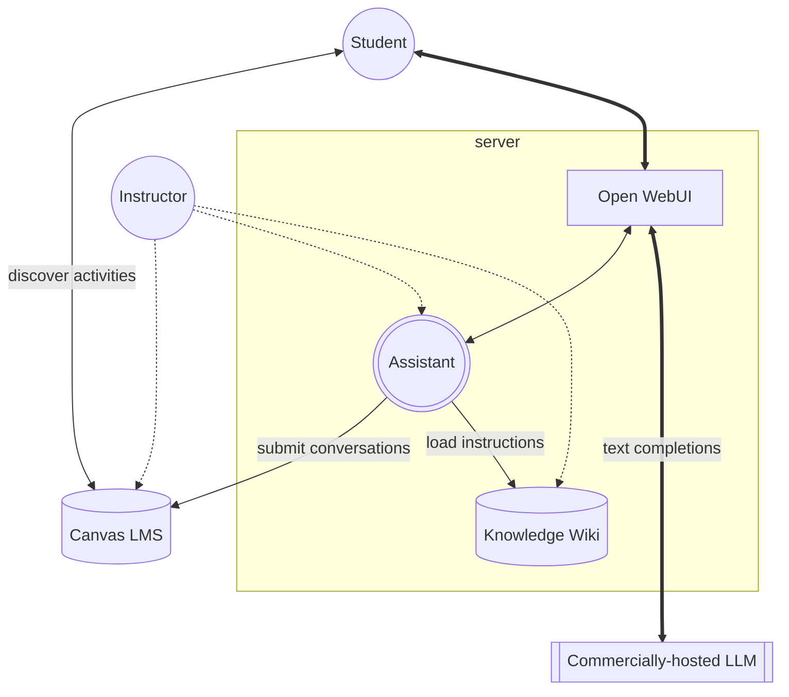
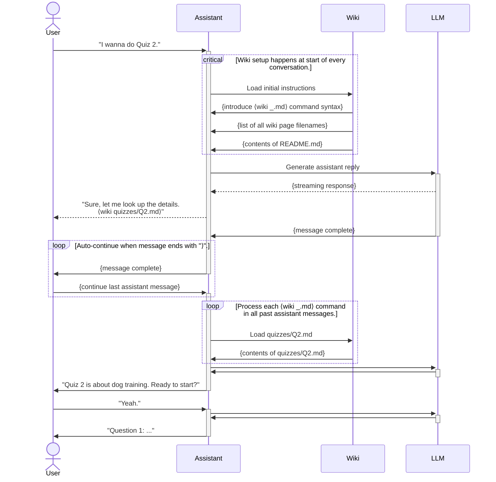
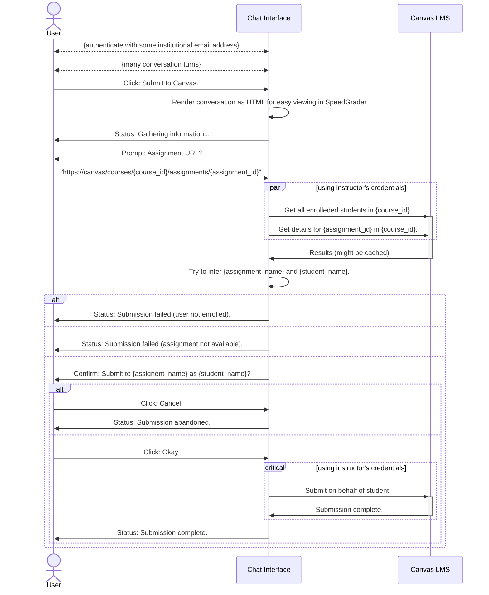

# Brace

Brace is an LLM-powered course assistant created [Adam Smith](https://adamsmith.as/) to help with teaching feedback-intensive courses with large student populations.

Brace offers:
- a free and (relatively) unlimited alternative to [ChatGPT](https://chatgpt.com/) that responds in a way that can be shaped by the course staff
- an inteface for engaging in dialog-based activities that aren't well supported by traditional learning management systems like [Canvas](https://www.instructure.com/canvas)
- a dispenser for knowledge from that FAQ on your syllabus that students often forget to read
- a way to provide individualized support to students when your human staff is unavailable
- a way to monitor and learn from student's GenAI usage
- ... (more, depending on what other features we add)

## Overview

Brace is composed of three major components:
- A **front-end chat interface** based on [Open WebUI](https://github.com/open-webui/open-webui) (OWUI). OWUI runs inside of a Docker container.
- A **middle-end assistant character**, Brace, that applies a customized system prompt when chatting with users, consulting the knowledge wiki as needed.
    - Brace uses a **knowledge wiki** consisting of a collection of linked Markdown documents providing the assistant with specialized knowledge and behavioral instructions relevant to the current conversational context. Unlike mainstream retrieval-augmented generation (RAG) engines, accesses to this wiki are based on explicit and exact lookup of entire documents (rather than implicit lookup of document fragments).
    - Brace allows students to submit conversation transcripts directly to assigments on the **Canvas LMS** (assuming they accept submissions in the form of HTML file uploads).
- A **back-end chat-completion engine** based on the [OpenAI Chat Completions API](https://platform.openai.com/docs/guides/chat-completions) (which is implemented by may providers beyond OpenAI).

## System Requirements

Before you deploy Brace, make sure you are willing to provide the following:
- A (virtual) machine with about 1GB of RAM, e.g. from [DigitalOcean](https://www.digitalocean.com/). In preliminary testing, the system seems to idle at ~500MB of RAM usage, but this leaves little room for unexpected growth in larger deployments that add services around Brace. We recommend 2GB of RAM for comfortable deployments.
- Access credentials for an OpenAI-compatible chat completion engine. This engine should offer a model with strength comparable to `gpt-4o-mini` or better. Weaker models seem to stumble over the knowledge wiki system, at least with the currently implemented prompting strategy.

## Knowledge Authoring

See [book/README.md](book/README.md) for details. The contents of the `book/` folder are made as `/book` inside of the OWUI container. These files are re-read during each chat-completion request, so the assistant's knowledge is always up to date. Rather than editing these files in a text editor by hand, we recommend using the [GitBook](https://www.gitbook.com/) authoring interface. This will help identify and fix broken links and keep the page index (`SUMMARY.md`) up to date. In a pinch, small, single-file edits can be made directly on GitHub.

## Provisioning

This section provides instructions for creating and configuring a virtual machine suitable for running a public version of Brace. You can privately test Brace on your own machine if you have Docker installed already.

Setting up a Digital Ocean droplet (recommended):
- Access your Digital Ocean control panel: https://cloud.digitalocean.com/
- Create > Droplet
- Region > San Francisco
- Datacenter > SFO2
- Image > Marketplace > Docker on Ubuntu 22.04
- Size > Basic > Regular > $12/mo
- Backups > Enable > Weekly $2.40/mo (probably a good idea, but obviously optional)
- Authentication > SSH key > select one you've created on your computer
- Improved Metrics > Enabled

Setting up an OpenAI account (recommended):
- Sign up at https://platform.openai.com/docs/overview
- (optional) Fund your account your account so you aren't subject to the free trial model and rate-limit constraints.

Setting up DNS (recommended):
- Point your desired domain name (e.g. `brace.tools`) at the IP address of the virtual machine you created above.

Testing remote access to Docker:
- In your computer's terminal, adapt this command for your domain name: `ssh root@brace.tools`
- Once connected via SSH, run `docker version` to verify that Docker is running.

Generate deployment keys (these allow your Docker host to pull from this repository)
- If you don't already already have a `~/.ssh/id_???.pub` file, run `ssh-keygen -t ed25519` to create one.
- Edit the Settings for this repository on GitHub to allow that key read access.

## Deployment

Clone this repository. If you followed the provisioning steps above, you will end up with a folder `/root/brace` containing all of the files in this repository.

Collect your OpenAI credentials (e.g. `OPENAI_AI_KEY`) into `openai.env`. This file is read when stack starts up.

For test deployments:
- Run `docker network create web` (This creates dummy network. In deployment, you'd provide a real network.)
- Run `docker compose up`

For production deployments:
- Use some other docker stack to provide a `traefik`-based reverse proxy on the `web` network.
- Run `docker compose up -d`
- Monitor the deployment with `docker compose logs -f`

Once running, you can access that chat interface at [http://localhost:3000](http://localhost:3000).

Unfortunately, there are some remaining manual setup steps:
- In OWUI, find Workspace > Models, hide all of the OpenAI models. (Shift-click to hide multiple models at once.)
- Maybe edit the value of `ENABLE_SIGNUP` in `docker-compose.yml` to `true` (temporarily) to allow yourself to create an admin account.

The OAuth stuff is setup to allow authentication with `@ucsc.edu` accounts when the server is running on `localhost:3000`. Contact `amsmith@ucsc.edu` if this needs to change.

# TODO (to get ready for course start)
- figure out how to make filters active/enabled by default 
- implement a rate limiting filter, but leave it disabled
- implement a langfuse monitoring filter, but leave it disabled
- nginx + cerbot as front end proxy (don't forget to disable buffering for websockets)
- populate Brace's dry (no wiki) system prompt
- populate Brace's wet (wiki) system prompt
- populate the wiki with some useful content

# TODO (to generalize for new courses)
- document expected usage patterns (e.g. typical number of conversation, turn depth, and token balance)
- implement enrollment filter?
    - at the start of every conversation, a filter uses a cached view of enrollment to decide if the current user is allowed to proceed with conversation, throw exception to kill convo otherwise
    - does this violate our principle of not proving enrollment in the transcripts?
- move course-specific data out of repo
    - think about how to have the dry system propmt also be configurable via file system
    - `/book` should just be example content under the assumption that future deployments will volume-mount another directory on top of this
    - think about whether the wiki pages can be pulled from Canvas pages on the fly (e.g. from an unpublished folder so that they aren't visible to students but are visible to )
- onboarding instuctions for both instructors and students!

# Diagrams

## Architecture

## Wiki interaction

## Submission flow
