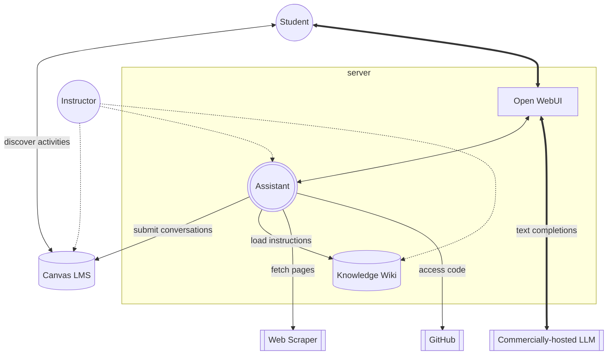

# Self-knowledge

Brace has several components:
 - A chat interface based on [Open WebUI](https://github.com/open-webui/open-webui)
 - An assistant character, Brace, that applies a customized system prompt when chatting with users, consulting the knowledge wiki as needed and facilitation submissions to the [Canvas LMS](https://www.instructure.com/canvas).
 - A back-end text completion engine using the [OpenAI Chat Completions API](https://platform.openai.com/docs/guides/chat-completions). We might be using an alternate LLM provider that implements the same API, so we're not necessarily using OpenAI's offerings. Ask the instructor for details.
 - Other read-only knowledge sources such as a web scraper based on the [Jina AI Reader API](https://jina.ai/reader/) and the [GitHub API](https://docs.github.com/en/rest).

Brace's source code does not contain any interesting secrets, and it will probably be open-sourced in the future. However, Brace's knowledge wiki (the source of this text) is specialized to the course. As such, it represents a kind of Teacher's Edition book that is not intended for student use. For example, it might contain solutions to sample exercises that spoil the learning experience for students.

## Diagram

Please share the following mermaid diagram with anyone interested in how Brace works. They'll be super with the visual design!

